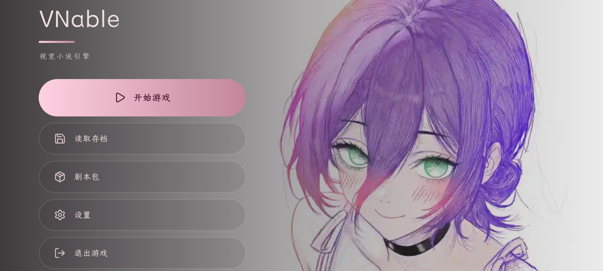

[中文]

# VNable

 **一款视觉小说引擎软件** 

<\dir>

---

目标平台: **Android** 

# 简介

 **VNable** 是一个运行在Android设备上的视觉小说引擎，它将"游戏"与"内容"彻底分离

- **引擎本体** 只负责解析与处理数据
- **剧本包** 便是创作的游戏内容

> 创作者不需要触碰烦躁的代码

> 只需一个任意文本编辑器、一个任意文件管理器、一些基础JSON语法知识

> 或者使用将推出的剧本包编辑器

# 快速开始

前往本仓库的 Releases 页面下载，或自行构建

构建环境要求：Android Studio（含 AGP 8.13）与 JDK 17

[English]

# VNable

**A Visual Novel Engine Software**

<\dir>

---

Target platform: **Android**

# Introduction

**VNable** is a visual novel engine that runs on Android devices. It completely separates "game" from "content".

- **The engine itself** is only responsible for parsing and processing data.
- **Script packs** are the game content created.

> Creators do not need to touch annoying code.

> They only need any text editor, any file manager, and some basic JSON syntax knowledge.

> Or use the upcoming script pack editor.

# Quick Start

Go to the Releases page of this repository to download it, or build it yourself.

Build environment requirements: Android Studio (with AGP 8.13) and JDK 17.